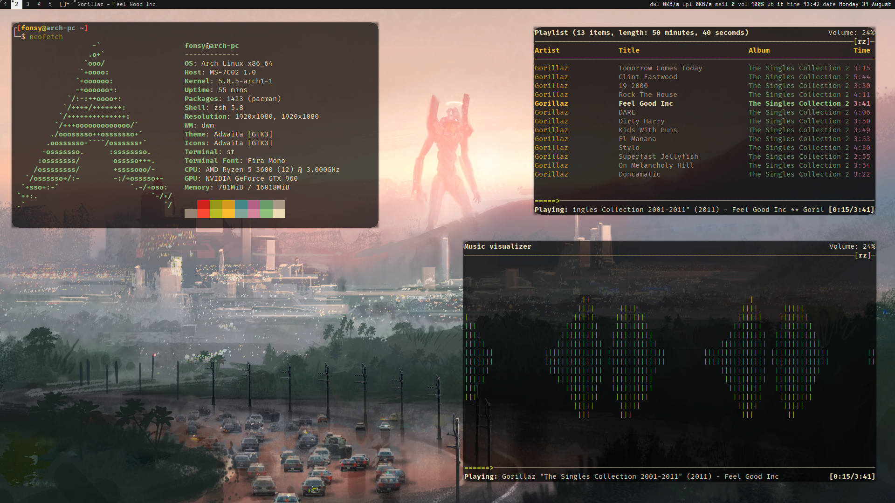

# suckless
This my fork of `dmenu`, `st` and `dwm`.

The font used in `dwm` is `Hermit`. The one used in `st` is `Fira Mono`.

# Installation
Clone the repo

	$ git clone https://github.com/its-fonsy/suckless.git

Install `dwm`

	$ cd suckless/dwm
	$ sudo make install

Install `dmenu`

	$ cd ..
	$ cd suckless/dmenu
	$ sudo make install

And install `st`

	$ cd ..
	$ cd suckless/st
	$ sudo make install

To use the same [bar](https://github.com/its-fonsy/dotfiles/blob/master/local/.local/bin/dwmbar) check my [dotfiles](https://github.com/its-fonsy/dotfiles).

# Features

+ `dwm` (`MOD` is windows key)
	* Press `MOD + P` and a window will spawn in the center of the screen with `pulsemixer`

+ `st` (`MOD` is ALT key)
	+ Support scroll with mouse wheel while pressing `SHIFT`
	+ Scroll up and down with `MOD + k` and `MOD + j`
	+ Scroll up and down a page with `MOD + u` and `MOD + d`
	* Use `MOD + c` to copy into clipboard
	* Use `MOD + v` to paste from clipboard
	* Use `MOD + l` to open a url on the browser (use `dmenu` to choose which one)
	* Use `MOD + y` to copy a url on the clipboard (use `dmenu` to choose which one)
